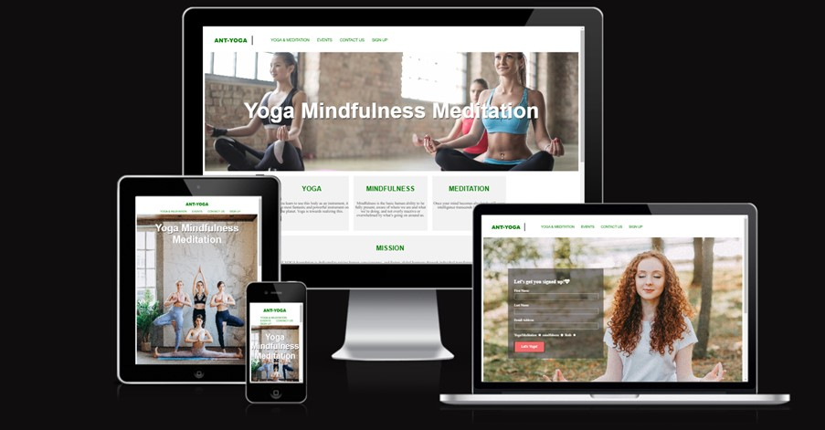
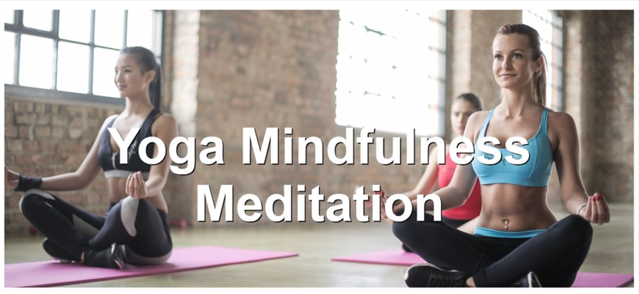
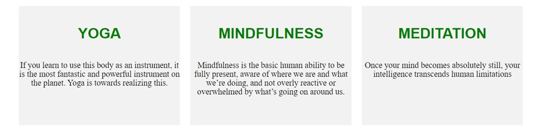
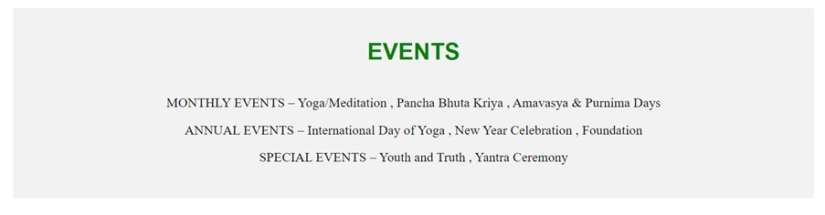
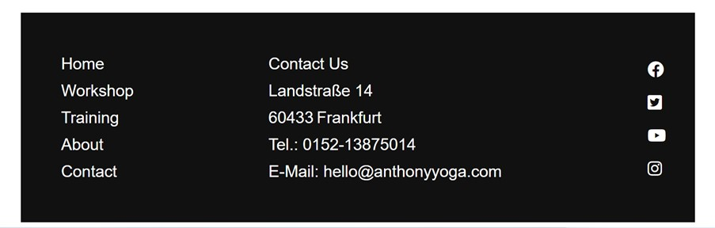
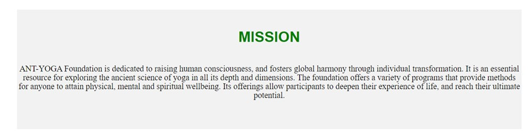
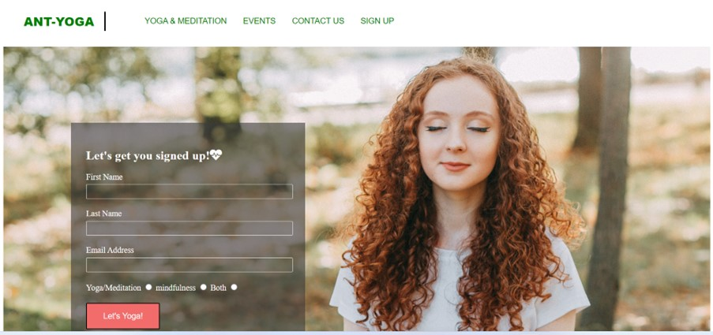
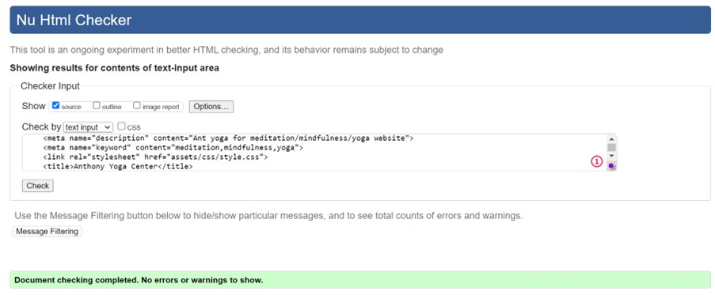
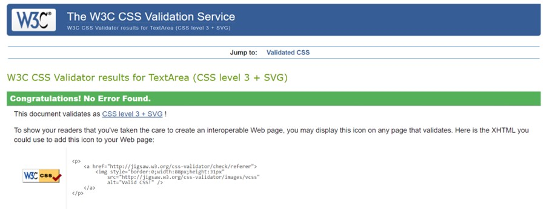

# ANT-YOGA
Ant Yoga websites offer information, guidance, and resources for practicing yoga, meditation, and mindfulness. Here are some popular options:

This website provides a wealth of information on various aspects of yoga, including poses, sequences, philosophy, history, and much more. It also offers articles, images, and tutorials on meditation and mindfulness practices.

•	Yoga: If you learn to use this body as an instrument, it is the most fantastic and powerful instrument on the planet. Yoga is towards realizing this.

•	Mindfulness: Mindfulness is the basic human ability to be fully present, aware of where we are and what we’re doing, and not overly reactive or overwhelmed by what’s going on around us.

•	Meditation: Once your mind becomes absolutely still, your intelligence transcends human limitations

•	Mission: ANT-YOGA Foundation is dedicated to raising human consciousness, and fosters global harmony through individual transformation. It is an essential resource for exploring the ancient science of yoga in all its depth and dimensions. The foundation offers a variety of programs that provide methods for anyone to attain physical, mental, and spiritual well-being. Its offerings allow participants to deepen their experience of life and reach their ultimate potential.

•	Events: Yoga/Meditation , Pancha Bhuta Kriya , Amavasya & Purnima Days
                        International Day of Yoga , New Year Celebration , Foundation
                        Youth and Truth , Yantra Ceremony

## 	Navigation Bar

o	Featured on all three pages, the full responsive navigation bar includes links to the Logo, Home page, Gallery and Sign Up page and is identical in each page to allow for easy navigation.

o	This section will allow the user to easily navigate from page to page across all devices without having to revert back to the previous page via the ‘back’ button.

##	The landing page image

## Index Section

o	The Index section provides an overview of the benefits of Yoga, Mindfulness, and Meditation.

o	This user will see the value of Yoga practice can also help to decrease physiological stress and arousal in the body. For example, meditation combined with regular yoga practice can lower blood pressure and heart rate, reduce inflammation in the body, and aid in reducing chronic pain issues..This should encourage the user to consider yoga as their form of exercise.

##	Events

o	This section will allow the user to see Monthly and Annual and Special Events 

## The Footer

o	The footer section includes links to the relevant social media sites for Ant Yoga. The links will open to a new tab to allow easy navigation for the user.

o	The footer is valuable to the user as it encourages them to keep connected via social media

o	The Contact Us section in the footer can be used to reach our yoga center

## Mission

o	ANT-YOGA Foundation is dedicated to raising human consciousness, and fosters global harmony through individual transformation. It is an essential resource for exploring the ancient science of yoga in all its depth and dimensions. The foundation offers a variety of programs that provide methods for anyone to attain physical, mental and spiritual wellbeing. Its offerings allow participants to deepen their experience of life, and reach their ultimate potential.

## The Sign Up Page

o	By signing up on this page, the user will be able to start practicing/registering for yoga, meditation, and mindfulness with the community. It will be possible for the user to specify whether they would like to practice Yoga/Meditation and mindfulness or both types of yoga. In order to use the service, the user must submit their full name and email address.

## Resources

•	[CodeInstitute](https://codeinstitute.net/de/) – Course material

•	[CodeInstitute](https://codeinstitute.net/de/) – Slack community

•	[W3Schools](https://profile.w3schools.com/log-in?redirect_url=https%3A%2F%2Fwww.w3schools.com%2F) - helped me in researching and fixing errors along the way

•	[AmIResponsive](https://ui.dev/amiresponsive) – Check the sites responsiveness

•	[W3CValidate](https://validator.w3.org/) - HTML code

•	[W3CCSS](https://jigsaw.w3.org/css-validator/) - CSS Validation

## Testing

o	I tested this page working different browsers: Chrome, Firefox, and Safari.

o	I confirmed that this project is responsive, looks good, and functions on all standard screen sizes using the devtools device toolbar.

o	I confirmed that the navigation, contact us and events text are all readable and easy to understand.

o	I have confirmed that the form works: requires entries in every field, will only accept an email in the email field, and the submit button works.

## Validator Testing

o	HTML
      No errors were returned when passing through the official W3C validator

o	CSS
      No errors were found when passing through the official (Jigsaw) validator

o	ACCESSIBILITY 
     I confirmed that the colors and fonts chosen are easy to read and accessible by running it through lighthouse in devtools

## Bugs

Solved bugs,

In mobile and tab responsive images, the text content does not align within the box
As a result of setting the box height size in media screen, I discovered this 

@media only screen and (max-width: 1000px)

•Adding the query and fixed the issue Responsiveness

I checked the website's responsiveness using Google Chrome Dev Tools. Mobile, tablet and desktop sizes were tested, and all worked well. It also responded on each breakpoint that were set up on Media Query's and no visual or functional errors found

## Version Control

•	GitHub

•	Gitpod

Gitpod served as the local repository and IDE. GitHUb served as the remote repository.

The following steps were followed to maintain version control;

•	I created a repository on GitHub and named it 'anthony-yoga-center'

•	I then signed in to Gitpod and opened a new workspace via the repository name 'anthony-yoga-center'

•	I created the pages, folders and files on GitPod

•	I saved my work on GitPod at regular intervals and pushed it to GitHub to keep it safe
This is the process I followed having completing each significant section of code, I typed the following into the terminal:

•	git add . (This added the work to git)

•	git commit -m "COMMIT MESSAGE" (This committed the work)

•	git push (This pushed the work to GitHub)

## Deployment

•	The site was deployed to GitHub pages. The steps to deploy are as follows:

o	In the GitHub repository, navigate to the Settings tab

o	From the source section drop-down menu, select the Master Branch

o	Once the master branch has been selected, the page will be automatically refreshed with a detailed ribbon display to indicate the successful deployment.

The live link can be found here - [Ant-Yoga](https://anthonyrajlucas.github.io/anthony-yoga-center/)

## Technologies used

•	[HTML5](https://en.wikipedia.org/wiki/HTML) for markup

•	[CSS3](https://en.wikipedia.org/wiki/CSS) for style

•	[GoogleFonts](https://fonts.google.com/) for fonts

•	[Github](https://github.com/) to keep the file

•	[Gitpod](https://www.gitpod.io/) for version control

•	[FontAwesome](https://fontawesome.com/v5/search) for icons

•	[pexels](https://www.pexels.com/) for all the images on the site

## Content 

o	Home page text was taken from Wikipedia and Google

o	Form validation instructions for the Sign Up page were taken from code institute challenge task

## Media

o	On the home page and sign-up page, photos are from pexels open source.

o	Images for the mobile and Tap responsive pages were taken from this pexels open source site

